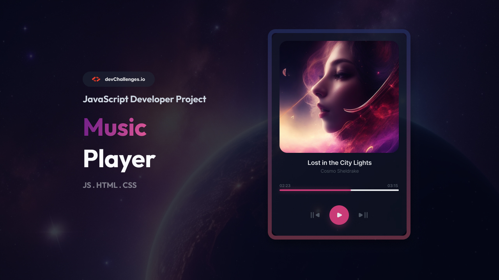

# Responsive Music Player

<div align="center">
  
</div>

<div align="center">
  <h3>
    <a href="https://devchallenges.io/challenge/music-player" target="_blank">
      🎯 Challenge
    </a>
  </h3>
</div>


---

## 🎯 Overview

A modern, responsive music player built with vanilla HTML, CSS, and JavaScript. This project features a sleek glassmorphism design with full audio playback functionality, playlist management, and responsive layout that works seamlessly across all devices.

### ✨ Key Highlights

- **Fully Responsive**: Optimized for mobile, tablet, and desktop devices
- **Modern UI/UX**: Glassmorphism design with smooth animations
- **Audio Playback**: Complete music player functionality with playlist support
- **Custom Controls**: Professional SVG icons with hover effects
- **Cross-Browser**: Compatible with all modern browsers

---

## 🚀 Features

### Core Functionality
- ▶️ **Play/Pause Control**: Toggle audio playback with visual feedback
- ⏭️ **Track Navigation**: Previous and next track functionality
- 🎵 **Playlist Support**: Multiple songs with automatic progression
- ⏱️ **Progress Tracking**: Real-time progress bar with seek functionality
- 🕐 **Time Display**: Current time and total duration indicators

### User Experience
- 📱 **Responsive Design**: Fluid layout adapting to all screen sizes
- 🎨 **Modern Aesthetics**: Glassmorphism effect with backdrop blur
- 🖼️ **Dynamic Album Art**: Automatic cover image updates per track
- ⚡ **Smooth Animations**: CSS transitions for enhanced interactions
- 🎯 **Intuitive Controls**: User-friendly interface with clear visual hierarchy

### Technical Features
- 🔧 **Vanilla JavaScript**: No external dependencies
- 📐 **CSS Grid & Flexbox**: Modern layout techniques
- 🎭 **Custom SVG Icons**: Scalable vector graphics for crisp display
- 📱 **Mobile-First**: Progressive enhancement approach
- ♿ **Accessibility**: Semantic HTML with proper ARIA labels

---

## 🛠️ Technologies Used

### Frontend
- **HTML5**: Semantic markup with audio element
- **CSS3**: Modern styling with custom properties, Grid, and Flexbox
- **JavaScript (ES6+)**: Vanilla JS for audio control and DOM manipulation

### Assets & Resources
- **SVG Icons**: Custom-designed scalable vector graphics
- **Audio Files**: MP3 format for cross-browser compatibility
- **Images**: Optimized JPEG files for album artwork and backgrounds

### Development Tools
- **Git**: Version control
- **VS Code**: Development environment
- **Browser DevTools**: Testing and debugging

---

## 🚀 Getting Started

### Prerequisites
- Modern web browser (Chrome, Firefox, Safari, Edge)
- Local web server (optional, for development)

### Installation

1. **Clone the repository**
   ```bash
   git clone https://github.com/Ayokanmi-Adejola/music-player.git
   cd music-player
   ```

2. **Open the project**
   ```bash
   # Option 1: Open directly in browser
   open index.html

   # Option 2: Use a local server (recommended)
   python -m http.server 8000
   # or
   npx serve .
   ```

3. **Access the application**
   - Direct: Open `index.html` in your browser
   - Server: Navigate to `http://localhost:8000`

### Quick Start
1. Click the play button to start audio playback
2. Use previous/next buttons to navigate between tracks
3. Click on the progress bar to seek to specific positions
4. Enjoy the responsive design on different devices

---

## 📁 Project Structure

```
music-player/
├── index.html              # Main HTML file
├── resources/              # Assets directory
│   ├── *.svg              # Custom SVG icons
│   ├── *.jpg              # Album artwork and backgrounds
│   ├── *.mp3              # Audio files
│   └── favicon.ico        # Site favicon
├── design/                # Design references
│   ├── Desktop_1350px.jpg # Desktop mockup
│   ├── Tablet_1024px.jpg  # Tablet mockup
│   └── Mobile_412px.jpg   # Mobile mockup
├── thumbnail.jpg          # Project preview image
└── README.md             # Project documentation
```

---

## 📱 Responsive Design

### Breakpoints
- **Mobile**: ≤ 480px
- **Small Tablet**: 481px - 768px
- **Large Tablet**: 769px - 1024px
- **Desktop**: > 1024px

### Responsive Features
- **Fluid Layout**: Adapts to any screen size
- **Touch-Friendly**: Optimized button sizes for mobile
- **Scalable Typography**: Responsive font sizes
- **Flexible Images**: Aspect-ratio maintained across devices
- **Optimized Spacing**: Contextual padding and margins

---

## 🌐 Browser Support

| Browser | Version | Status |
|---------|---------|--------|
| Chrome  | 60+     | ✅ Full Support |
| Firefox | 55+     | ✅ Full Support |
| Safari  | 12+     | ✅ Full Support |
| Edge    | 79+     | ✅ Full Support |
| Opera   | 47+     | ✅ Full Support |

### Required Features
- CSS Grid and Flexbox support
- HTML5 Audio API
- ES6+ JavaScript features
- CSS Custom Properties

---

## 🤝 Contributing


### Development Guidelines
1. Fork the repository
2. Create a feature branch (`git checkout -b feature/AmazingFeature`)
3. Commit your changes (`git commit -m 'Add some AmazingFeature'`)
4. Push to the branch (`git push origin feature/AmazingFeature`)
5. Open a Pull Request

### Code Standards
- Use semantic HTML5 elements
- Follow BEM methodology for CSS classes
- Write clean, commented JavaScript
- Ensure responsive design principles
- Test across multiple browsers


---

## 🙏 Acknowledgments

- **[devChallenges.io](https://devchallenges.io/)** - For providing the design challenge
- **Design Inspiration** - Modern music player interfaces
- **Audio Assets** - Sample tracks for demonstration
- **Community** - Feedback and suggestions from fellow developers

---
# Music-Player
# Music-Player
# Music-Player
# Music-Player
